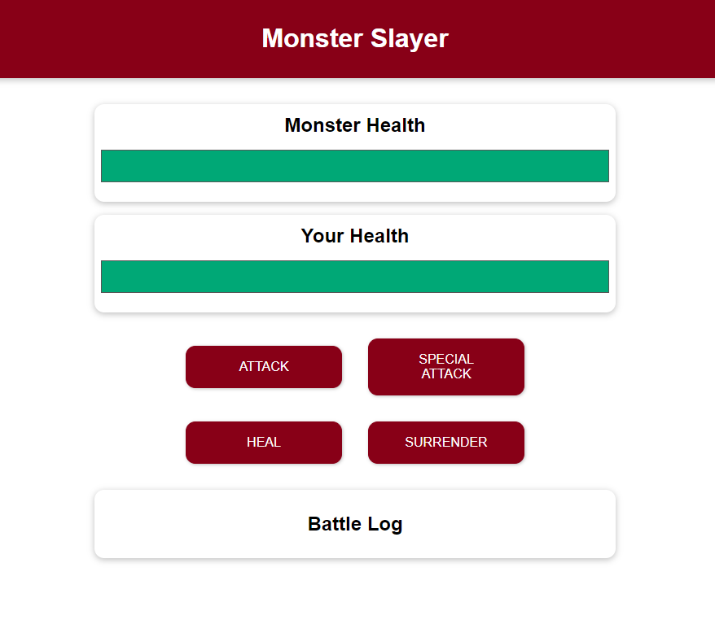

# Vue.js - Monster Slayer
*Met dank aan de creativiteit van Robin Braibant voor deze opgave* :-)

## Deel 1

In dit labo ga je een simpele game (Monster Slayer) bouwen met de aangeleerde functionaliteiten binnen Vue.js!

Gebruik de HTML- en Sass-code uit de templates-folder. De logica, de scriptcode dus, dient nog volledig opgebouwd te worden.

### Project
Maak een nieuw Vue project aan. Bij het aanmaken hoef je geen enkele van de opties te gebruiken en mag je dus telkens ‘No’ antwoorden. Eens je het project hebt aangemaakt, verwijder je de mappen en bestanden die je niet nodig hebt:
-	Maak de assets map leeg
-	Verwijder de components map
-	Verwijder de views map
-	Maak het App.vue bestand leeg zodat je enkel een leeg script, template en style element overhoudt.

### HTML
- Wijzig het id van de applicatie van app naar game. Pas dit aan in het index.html en het main.js bestand.
- Gebruik de aangeleverde [HTML code](templates/HTML.md) en integreer deze op de juiste plaats in het App.vue bestand

### Opmaak
- Integreer de aangeleverde scss-code in je project, zodat de styling wordt toegepast op de HTML code.
- Gebruik volgende link om een Google font te gebruiken in je project:
[https://fonts.googleapis.com/css2?family=Jost:wght@400;700&display=swap](https://fonts.googleapis.com/css2?family=Jost:wght@400;700&display=swap)

### Attack !!!
##### Functionaliteit
Wanneer je de applicatie nu een eerste keer built, zal je zien dat de website zal getoond worden, maar wel zonder afbeeldingen.

##### Data
Zorg ervoor dat de data eigenschap volgende eigenschappen terug geeft:
-	playerHealth met een waarde van 100;
-	monsterHealth met een waarde van 100;

##### Methods
Maak een methode *attackMonster* aan die het volgende doet:
- Bereken de schade op basis van een willekeurig getal tussen 5 en 12, gebruik hiervoor een functie.
    - Tip: geef de volgende opdracht aan [ChatGPT](chat.openai.com): "*create a javascript function to generate a random number between 2 given numbers*" 
    - Of zie: https://stackoverflow.com/questions/4959975/generate-random-number-between-two-numbers-in-javascript
- Zorg ervoor dat de ‘health’ van het monster met die waarde afneemt.

Maak een methode *attackPlayer* aan die het volgende doet:
-	De schade die het monster aanricht is groter dan die dat wij aanrichten. Bereken daarom een willekeurig getal tussen 8 en 15.
-	Zorg ervoor dat de ‘health’ van de speler met die waarde afneemt.

Zorg er nu voor dat de methode waarbij de speler wordt aangevallen, opgeroepen wordt binnen de methode waarin het monster wordt aangevallen. Op die manier kunnen we tegelijkertijd de speler en het monster laten aanvallen.

##### Event
Zorg ervoor dat wanneer je op de ‘Attack’ knop klikt, de juiste methode wordt aangesproken. 

## Deel 2

### Health bar
De health wordt afgebeeld in een strook of ‘bar’ en wordt in de HTML vertegenwoordigd door het div element met de klasse healthbar__value. 
Zorg er nu voor dat je met attribute binding op het juiste attribuut de breedte van dit element dynamisch wijzigt op basis van de waarde van de health eigenschap van het respectievelijke object (monster of player). 

Om een waarde te geven aan het attribuut, maak je gebruik van computed properties (bv monsterBarStyles en playerBarStyles).
Zorg er binnen deze computed properties voor dat:
Wanneer de waarde van de respectievelijke health eigenschap onder 0 gaat, een breedte van 0% wordt terug gegeven.
In alle andere gevallen geef je een breedte terug in percent ter waarde van de respectievelijke health eigenschap.

### Special attack
##### Method
Voeg een methode, specialAttackMonster toe die extra schade aanricht aan het monster. Opgelet, deze aanval is enkel na elke drie ronden beschikbaar.
-	Bereken de schade op basis van een willekeurig getal tussen 10 en 25.
-	Zorg ervoor dat de health van het monster met die waarde afneemt.
-	Zorg er eveneens voor dat het monster terug aanvalt.

##### Rondes
Om de rondes bij te houden voeg je een nieuwe data eigenschap *currentRound* toe die als startwaarde het getal 0 krijgt. Zorg er vervolgens voor dat elke keer het monster wordt aangevallen, de waarde met 1 wordt verhoogd.

##### Event
Zorg ervoor dat wanneer je op de Special Attack knop klikt, de juiste methode wordt aangesproken. 

Zorg er ook voor dat de knop gedisabled wordt wanneer de waarde van de currentRound eigenschap niet deelbaar is door 3. Gebruik hiervoor het disabled attribuut van de knop.

Schrijf de logica hiervoor in een computed property (bv mayUseSpecialAttack) en laad deze op de juiste plaats in.

### Heal
##### Method
Schrijf een methode healPlayer, die ervoor zorgt dat als we als speler te veel schade hebben geleden, we onszelf kunnen genezen.
-	Bereken de heal op basis van een willekeurig getal tussen 8 en 20.
-	Doe het nodige zodat deze methode meetelt als een ronde.
-	Zorg er eveneens voor dat het monster terug aanvalt wanneer de methode wordt gebruikt.

Het probleem dat zich nu stelt is dat de health van een speler nu de 100 kan overschrijden. Zorg er daarom met een conditie voor dat dit niet kan gebeuren.

##### Event
Zorg ervoor dat wanneer je op de Heal knop klikt, de juiste methode wordt aangesproken.

